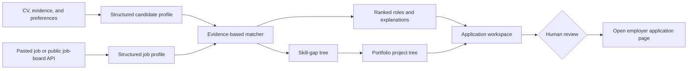
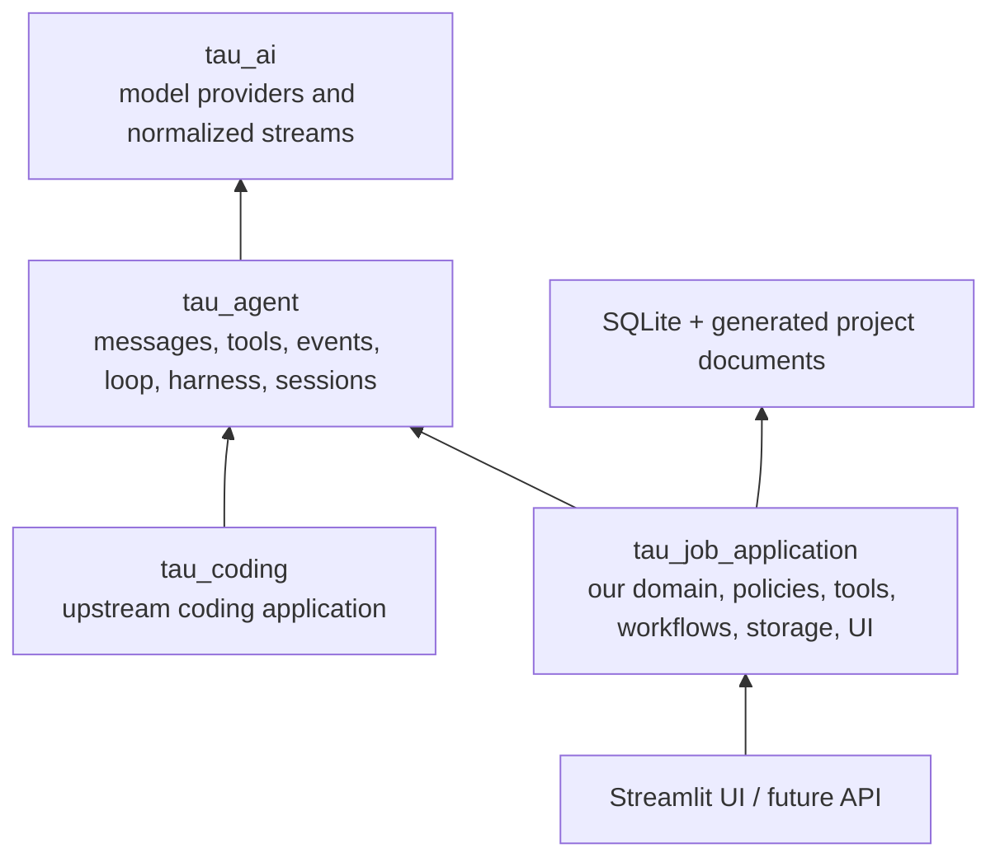
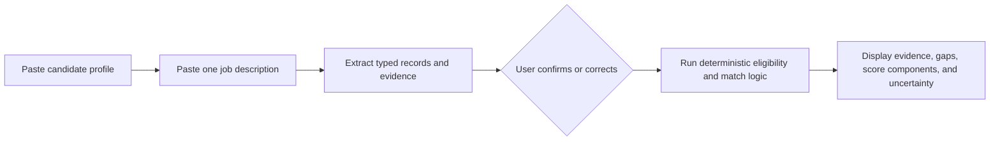
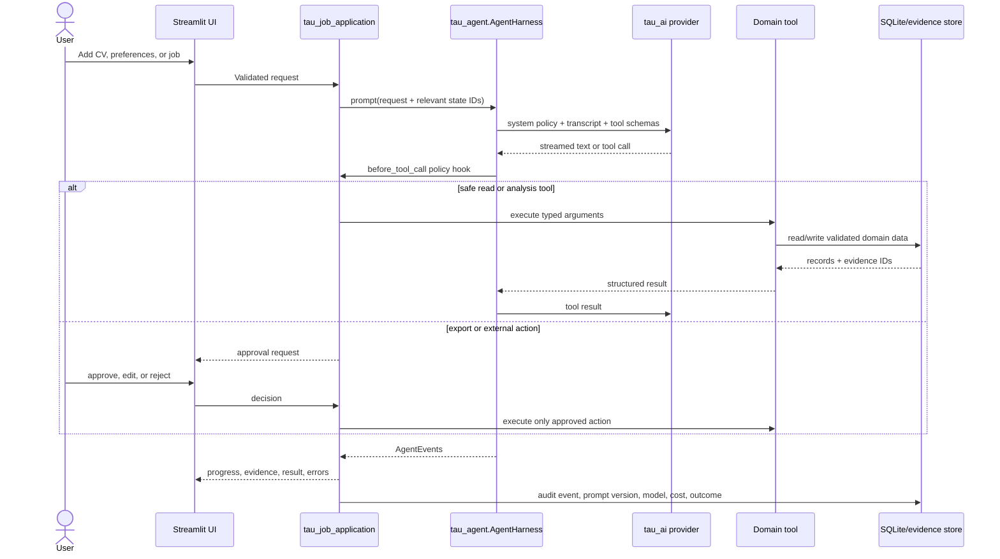

# Personal_AI_agent_job_application
The goal of this project is to build a personal AI agent in order to enable people to get more interviews with targeted companies. This agent will help you focus on concrete project that you can build on your own and give you all the ressources to actually learn during the process. 

<!-- PROJECT_RESEARCH_BRIEF_START -->

## Project Research Brief

_Prepared 18 July 2026. This is a three-weekend MVP brief, not a detailed implementation backlog._

### 1. Project summary

Build a local-first personal job-application assistant that helps one job seeker decide where to apply and how to become a stronger candidate. It should accept a CV/profile, preferences, and job descriptions; rank roles with evidence; identify skill gaps; turn those gaps into a dependency-aware learning tree and portfolio project tree; and prepare truthful, tailored application drafts for the user to review.

The MVP pipeline is:



The assistant must never invent experience, qualifications, metrics, or projects. Every match explanation and application claim should link back to either candidate evidence or wording in the job description.

### 2. Assumptions and constraints

**User-provided requirements**

- Delivery window: three weekends.
- Find or accept interesting jobs from the web or LinkedIn.
- Build an application pipeline, a role-specific skill tree, and a project tree.
- Give each proposed portfolio project clear documentation.

**Working assumptions**

- One user, English-language roles, and an initial focus on Switzerland/EU opportunities.
- Intermediate Python ability and roughly 10–14 focused hours per weekend.
- Python 3.12 or newer, because the current Tau package requires it.
- A small paid LLM/API budget is acceptable; candidate data remains local except for text explicitly sent to the selected model provider.
- “Project tree” means an ordered set of portfolio projects with prerequisites, not automatically generated finished projects.

**Hard scope boundaries**

- Do not scrape, automate, or auto-apply on LinkedIn. LinkedIn says third-party tools may not scrape or automate activity, and its User Agreement prohibits scraping and unauthorized bots ([LinkedIn Help](https://www.linkedin.com/help/linkedin/answer/a1340567), [User Agreement](https://www.linkedin.com/legal/user-agreement)). For LinkedIn roles, the MVP accepts text or a job description supplied by the user.
- Discover jobs through user-pasted descriptions and permitted public sources. Greenhouse exposes public job-board GET endpoints without authentication, while Lever documents a public postings API ([Greenhouse Job Board API](https://developers.greenhouse.io/job-board.html), [Lever Postings API](https://github.com/lever/postings-api)).
- Do not submit applications in the MVP. Open the official employer application page only after user review.
- Do not build a general web crawler, browser extension, multi-user service, autonomous outreach agent, or production deployment in the three-weekend scope.
- Pin the Tau dependency to a tested release. Tau describes itself as an educational project under active development; the repository's latest release at the time of this brief is v0.2.0 from 16 July 2026 ([Hugging Face Tau](https://github.com/huggingface/tau)).

### 3. Achievable goal and definition of success

**Goal:** By 2 August 2026, deliver a runnable local application that turns a CV, preferences, and at least ten test job descriptions into an auditable shortlist, a skill-gap tree, a sequenced portfolio project tree, and a reviewed application pack for a selected role.

The MVP is successful when it can:

1. Import one CV/profile and at least ten jobs through paste/URL input or Greenhouse/Lever public data.
2. Extract a consistent job schema: title, employer, location, seniority, required/preferred skills, responsibilities, constraints, and source URL.
3. Rank jobs and show both supporting evidence and missing evidence; the user judges at least four of the top five recommendations reasonable.
4. Produce a skill tree that separates **demonstrated**, **partial**, **missing**, and **uncertain** skills and links every gap to source text.
5. Produce three prioritized portfolio project briefs. Each brief includes purpose, targeted skills, prerequisites, deliverables, milestones, acceptance criteria, evidence to publish, learning resources, estimated effort, and a README outline.
6. Draft a role-specific CV change list, cover-letter outline, and interview preparation questions without introducing unsupported claims.
7. Require explicit human approval before opening an application page or exporting any externally shared document.
8. Pass a small regression set of ten saved jobs with structured fields present and no fabricated candidate facts. Because generative outputs vary, repeatable evaluation examples are more reliable than testing a single “good” response ([OpenAI evaluation guidance](https://developers.openai.com/api/docs/guides/evaluation-best-practices)).

### 4. Essential sources to read

1. **Essential — [LinkedIn automated activity guidance](https://www.linkedin.com/help/linkedin/answer/a1340567) and [User Agreement, section 8.2](https://www.linkedin.com/legal/user-agreement).** LinkedIn; current pages, accessed 18 July 2026. Read before designing ingestion. These rules determine why LinkedIn must be a user-controlled input rather than an automated connector.
2. **Essential — [ESCO API](https://esco.ec.europa.eu/en/about-esco/escopedia/escopedia/esco-api).** European Commission, ESCO v1.2.1 updated 10 December 2025; accessed 18 July 2026. Focus on occupation/skill concept identifiers and occupation-to-skill relationships. ESCO provides a multilingual, reusable vocabulary suited to normalizing skill names and building the tree.
3. **Essential — [Hugging Face Tau](https://github.com/huggingface/tau), [architecture](https://twotimespi.dev/internals/architecture/), and [agent loop](https://twotimespi.dev/internals/agent-loop/).** Hugging Face, Tau v0.2.0 released 16 July 2026; accessed 18 July 2026. Focus on the one-way dependency rule, `AgentHarness`, typed tools, event streaming, and sessions. Our application must wrap the portable core rather than modify it.
4. **Essential — [Evaluation best practices](https://developers.openai.com/api/docs/guides/evaluation-best-practices).** OpenAI; current guide, accessed 18 July 2026. Focus on task-specific test cases, classification/scoring criteria, and continuous evaluation. The guide notes that model outputs are variable, so the saved ten-job evaluation set is a product requirement rather than polish.

### 5. Useful sources, tools, communities, or places to visit

- **Useful — [Greenhouse Job Board API](https://developers.greenhouse.io/job-board.html).** Greenhouse; current documentation, accessed 18 July 2026. Focus on `GET /v1/boards/{board_token}/jobs?content=true`. It supplies public structured jobs without credentials.
- **Useful — [Lever Postings API](https://github.com/lever/postings-api).** Lever; maintained public repository, accessed 18 July 2026. Focus on JSON list/detail GET endpoints and the EU base URL. Ignore application POST endpoints for the MVP.
- **Useful — [Schema.org JobPosting](https://schema.org/JobPosting).** Schema.org; current vocabulary, accessed 18 July 2026. Use its common fields as guidance for the internal job model and future parsing of employer career pages.
- **Useful — [Streamlit first steps](https://docs.streamlit.io/get-started/tutorials).** Streamlit; current documentation, accessed 18 July 2026. A small multipage local UI is realistic within the timebox.
- **Optional — [ESCO downloadable data](https://esco.ec.europa.eu/en/use-esco/download).** European Commission, ESCO v1.2.1 updated 10 December 2025; accessed 18 July 2026. Prefer the hosted API initially; consider the downloadable dataset only if latency, offline use, or reproducibility becomes important.

**Chosen technical shape:** Python 3.12+, `tau_ai` for provider-neutral model access, `tau_agent` for the reusable agent harness, and our `tau_job_application` package for all job-domain behavior. Use Pydantic models at every tool boundary, SQLite for local domain state, ESCO for skill normalization, and Streamlit for the first UI. Matching remains hybrid and explainable: deterministic code enforces constraints and calculates scores; the model performs bounded extraction, semantic mapping, explanation, and drafting.

#### Chosen Tau architecture

Tau deliberately separates its reusable brain from application-specific code. The official dependency direction is `tau_coding → tau_agent → tau_ai`; its core is UI-free and frontends consume provider-neutral events ([Tau architecture](https://twotimespi.dev/internals/architecture/)). We follow the same design with a sibling application:



`tau_job_application` does not import or modify `tau_coding`. It uses `AgentHarness`, registers job-domain tools, consumes `AgentEvent` objects, and owns every product policy. Candidate and job records live in SQLite rather than solely in the conversation transcript.

Suggested package boundary:

```text
src/tau_job_application/
├── agent.py                 # AgentHarness construction and system policy
├── config.py                # model, scoring weights, source settings
├── models/                  # candidate, job, evidence, skill, project, application
├── tools/                   # narrow AgentTool adapters
├── services/                # deterministic extraction, scoring, trees, claim checks
├── sources/                 # paste, Greenhouse, Lever; LinkedIn remains user-supplied
├── storage/                 # SQLite repositories and migrations
├── workflows/               # explicit pipeline state and transitions
├── approvals/               # approve, edit, reject external/export actions
├── rendering/               # Tau event-to-UI view models
├── ui/                      # Streamlit pages
└── evals/                   # fixtures, scenarios, graders, regression reports
```

#### How to start: use Tau as a dependency

Do **not** reimplement the agent loop, copy Tau's source into this repository, or fork Tau as the starting point. Install a pinned Tau release and build only the job-application layer here:

```text
Installed dependency             Code owned by this project
────────────────────             ──────────────────────────
tau_ai                       ←──  provider configuration
tau_agent                    ←──  agent harness and domain-tool registration
                                 tau_job_application
```

The names are easy to confuse:

```text
Distribution installed from PyPI:  tau-ai==0.2.0
Python packages imported in code:  tau_ai, tau_agent
Package built in this repository:   tau_job_application
```

For the three-weekend MVP, consume Tau as a library. Clone the upstream repository separately only if reading it locally is more convenient; do not vendor it into this project. Keep Tau behind the small adapter in `agent.py` so a later upgrade does not spread framework-specific code through the domain.

##### Step 1 — Create the minimal environment

From this repository, initialize a Python 3.12 package and install only what is needed for the first integration test:

```bash
uv init --package --name tau-job-application
uv python pin 3.12
uv add "tau-ai==0.2.0" pydantic
uv add --dev pytest pytest-asyncio
```

If a `pyproject.toml` already exists when implementation begins, do not run `uv init` again; update the existing project instead. Add Streamlit, database migrations, document parsers, ESCO clients, and embedding libraries only when the vertical slice needs them.

The first local files should stay small:

```text
src/tau_job_application/
├── __init__.py
├── agent.py
├── models.py
└── tools.py
tests/
└── test_agent_spike.py
```

##### Step 2 — Build one Tau integration spike

Before building the product pipeline, prove that the framework boundary works:

1. Configure one model provider through `tau_ai`.
2. Construct `tau_agent.AgentHarness` with a short system policy and a strict turn limit.
3. Register one custom typed tool.
4. Send one prompt through `AgentHarness.prompt()`.
5. Consume and print the streamed `AgentEvent` objects.
6. Test the tool call with a fake provider so the basic test does not depend on network access or model variability.

Use a deliberately small first tool:

```text
compare_candidate_to_job(candidate_text, job_description) -> MatchPreview
```

Its initial result may be deterministic or fixture-based:

```json
{
  "matching_skills": ["Python", "SQL"],
  "missing_skills": ["Docker"],
  "eligible": true,
  "evidence_ids": ["candidate:1", "job:3"]
}
```

The spike succeeds when Tau selects the tool, the arguments validate, the result returns through the agent loop, the events are observable, and the run stops within the configured limit. Do not proceed if tool calls or event behavior are still unclear.

##### Step 3 — Establish the evidence model

Create these four Pydantic models before adding APIs or a graphical interface:

```text
CandidateProfile
JobPosting
EvidenceItem
MatchResult
```

Every material candidate fact and job requirement must reference an `EvidenceItem`. An evidence item records a stable ID, source type, source location or quoted span, capture time, and confirmation status. For example:

```text
Fact:       Candidate demonstrates Python
Evidence:   “Developed a Python forecasting pipeline”
Source:     CV, work-experience paragraph 2
Status:     confirmed by user
```

This provenance model is the shared foundation for matching, skill status, project recommendations, application drafts, and fabrication checks. Correct structured data rather than rewriting the raw evidence, and retain versions of confirmed changes.

##### Step 4 — Complete the first vertical slice

Build the smallest useful workflow before adding discovery integrations:



The Weekend 1 exit criterion is:

> Given one manually entered candidate profile and one job description, Tau calls our job-domain tools and produces a structured, evidence-linked comparison without inventing candidate facts.

Use plain text inputs and a console output for this milestone. Once it passes, add SQLite persistence, then a simple Streamlit interface, and only afterward add permitted job-board sources.

##### What comes from Tau and what we build

| Tau supplies | `tau_job_application` supplies |
|---|---|
| Provider-neutral model access | Candidate, job, evidence, skill, project, and application models |
| Messages and agent loop | Job ingestion and requirement extraction |
| Typed-tool protocol | Eligibility rules and deterministic match scoring |
| Agent events and streaming | ESCO normalization and skill/project graphs |
| Harness, cancellation, and lifecycle hooks | Claim validation and approval policies |
| Conversation/session primitives | SQLite domain state, Streamlit UI, exports, and evaluations |

##### Do not start with these

- Forking or changing Tau internals.
- Multiple agents or agent-to-agent delegation.
- LinkedIn scraping, browser automation, or automatic applications.
- Greenhouse, Lever, or general web discovery before manual input works.
- A vector database, embeddings, or RAG infrastructure before evidence IDs work.
- CV PDF/DOCX parsing before the editable profile schema is stable.
- The full skill tree, project tree, and application-document generator at once.
- Styling or deployment before the saved ten-job evaluation set passes.

The implementation order is therefore: **Tau spike → evidence models → one-job vertical slice → deterministic scoring tests → SQLite → Streamlit → skill/project trees → application workspace → permitted job sources**.

#### Tau files to read, in order

All files are from Hugging Face's Tau repository and were accessed 18 July 2026.

1. **Essential — [`README.md`](https://github.com/huggingface/tau/blob/main/README.md).** Read “What is Tau?”, “Philosophy”, and “Use Tau as a library” to understand the supported extension point.
2. **Essential — [Architecture overview](https://twotimespi.dev/internals/architecture/).** Learn the package boundaries and one-way dependency rule that our new layer must preserve.
3. **Essential — [`tau_agent/harness.py`](https://github.com/huggingface/tau/blob/main/src/tau_agent/harness.py).** Focus on `AgentHarnessConfig`, `AgentHarness.prompt()`, event subscriptions, cancellation, and the `before_tool_call`/`after_tool_call` hooks. These hooks are where approval and audit policies attach.
4. **Essential — [`tau_agent/tools.py`](https://github.com/huggingface/tau/blob/main/src/tau_agent/tools.py).** Learn the `AgentTool` schema and executor contract before writing job-domain tools.
5. **Essential — [`tau_agent/loop.py`](https://github.com/huggingface/tau/blob/main/src/tau_agent/loop.py) and [agent-loop guide](https://twotimespi.dev/internals/agent-loop/).** Follow how the model requests tools, results return to the transcript, and the loop stops. Set bounded turns and never hide important business state inside this loop.
6. **Useful — [`tau_agent/events.py`](https://github.com/huggingface/tau/blob/main/src/tau_agent/events.py), [`messages.py`](https://github.com/huggingface/tau/blob/main/src/tau_agent/messages.py), and [`provider.py`](https://github.com/huggingface/tau/blob/main/src/tau_agent/provider.py).** These define the provider-neutral contract that Streamlit will render and the message types we will persist or redact.
7. **Useful — [`tau_ai`](https://github.com/huggingface/tau/tree/main/src/tau_ai).** Read after the portable agent core to understand provider adaptation. Do not put job-domain policy in this package.
8. **Useful reference, not a dependency — [`tau_coding/session.py`](https://github.com/huggingface/tau/blob/main/src/tau_coding/session.py), [`system_prompt.py`](https://github.com/huggingface/tau/blob/main/src/tau_coding/system_prompt.py), [`tools.py`](https://github.com/huggingface/tau/blob/main/src/tau_coding/tools.py), and [`rendering/`](https://github.com/huggingface/tau/tree/main/src/tau_coding/rendering).** Study how an application wraps the harness, but reimplement these patterns for job applications instead of importing the coding layer.
9. **Useful — [`tests/`](https://github.com/huggingface/tau/tree/main/tests).** Copy Tau's testing style for event sequences, tool calls, cancellations, and provider fakes before adding domain scenarios.

#### Research papers and the feature each contributes

These papers guide design; they are not extra frameworks and do not all imply model training.

| Priority | Paper | What to study | Concrete integration in this project |
|---|---|---|---|
| Essential | **ReAct: Synergizing Reasoning and Acting in Language Models**, Yao et al., submitted 6 October 2022 ([paper](https://arxiv.org/abs/2210.03629)) | The alternating action/observation loop and exception handling. | Use Tau's bounded tool loop for “inspect state → call one narrow tool → observe result → continue.” Log actions and evidence, but do not expose private chain-of-thought. |
| Essential | **Toolformer: Language Models Can Teach Themselves to Use Tools**, Schick et al., submitted 9 February 2023 ([paper](https://arxiv.org/abs/2302.04761)) | When a tool is useful, clear API arguments, and incorporating returned results. | Give every `AgentTool` a narrow purpose, strict Pydantic input/output, precise description, structured errors, and examples. Deterministic code—not the model—calculates scores and validates claims. |
| Essential | **Retrieval-Augmented Generation for Knowledge-Intensive NLP Tasks**, Lewis et al., submitted 22 May 2020 ([paper](https://arxiv.org/abs/2005.11401)) | External, inspectable memory and provenance for generation. | Build an evidence pack from CV facts, job requirements, and ESCO records before drafting. Every application claim must reference an evidence ID; missing evidence becomes a question, never an invented fact. A vector database is unnecessary for the MVP. |
| Useful | **Sentence-BERT: Sentence Embeddings using Siamese BERT-Networks**, Reimers and Gurevych, submitted 27 August 2019 ([paper](https://arxiv.org/abs/1908.10084)) | Efficient semantic similarity using sentence embeddings and cosine similarity. | Use embeddings only to propose equivalences between job skills, candidate evidence, and ESCO labels. Combine similarity with exact aliases and human confirmation; never treat cosine similarity as proof of competence. |
| Essential for evaluation | **τ-bench: A Benchmark for Tool-Agent-User Interaction in Real-World Domains**, Yao et al., submitted 17 June 2024 ([paper](https://arxiv.org/abs/2406.12045)) | Stateful tasks, domain policies, final-state checks, and reliability across repeated trials. | Create job-application scenarios with initial database state, user goal, allowed tools, policies, and expected final state. Test repeated runs for policy compliance, correct records, no unauthorized action, and no fabricated claim. |

### 6. Comprehensive application pipeline

#### Runtime control flow



Tau owns the conversational loop; `tau_job_application` owns the workflow state. A model may choose among allowed analysis tools, but it may not bypass state transitions, calculate its own official match score, write unvalidated records, or perform external actions.

#### Pipeline stages and contracts

| Stage | Inputs | Processing and responsible layer | Persisted output | Required validation |
|---|---|---|---|---|
| **0. Session and policy bootstrap** | User/session ID, provider choice, model, configuration | `tau_ai` creates the provider; `tau_job_application.agent` constructs `AgentHarness` with system policy, tools, turn limit, and hooks. | Session metadata, prompt version, model, allowed tools | Provider smoke test; tools have unique names and JSON-compatible schemas; external tools default to denied. |
| **1. Candidate onboarding** | CV file/text, portfolio links supplied by user, goals, location, work authorization, preferences | Parse sections into typed candidate facts; preserve exact source spans; show an editable profile. | `CandidateProfile`, `EvidenceItem[]`, `PreferenceProfile` | User confirms all material facts; each skill/achievement has evidence or is marked self-reported/uncertain. |
| **2. Job ingestion** | Pasted description, approved employer URL, Greenhouse or Lever record | Normalize text and metadata, preserve raw snapshot and retrieval time, deduplicate by canonical URL plus content hash. LinkedIn remains paste/manual only. | `JobPosting`, raw source snapshot, provenance | Source allowed; title/employer/location present; stale/closed jobs visibly flagged; no silent page crawling. |
| **3. Requirement extraction** | Raw job snapshot | Model-assisted structured extraction into responsibilities, must-have/preferred skills, seniority, language, location, visa, education, and application requirements. | `JobRequirement[]` with type, confidence, and evidence span | Schema validation; every requirement cites source text; ambiguous requirements remain `uncertain`. |
| **4. Skill normalization** | Candidate skills and job requirements | Exact aliases and ESCO lookup first; embedding similarity proposes mappings; the model explains ambiguous mappings. | `SkillConcept`, raw label, ESCO URI when available, mapping confidence | Never discard original wording; low-confidence mappings require user confirmation; taxonomy is reference, not truth. |
| **5. Eligibility gates** | Preferences, hard constraints, normalized job | Deterministic rules check location, work authorization, language, seniority bounds, employment type, and user exclusions. | `EligibilityResult` with pass/fail/unknown per rule | Unknown never becomes pass; rejected jobs remain visible with reasons; weights cannot override a failed hard gate unless the user edits the rule. |
| **6. Match scoring** | Candidate evidence, job requirements, preferences | Deterministic scorer calculates components; semantic matching supplies candidates, not final facts. Default weights: must-have coverage 35%, evidence strength 20%, seniority/experience 15%, user preferences 15%, learning value 10%, application effort 5%. | `MatchScore` plus component breakdown and unmatched requirements | Weights sum to 100; score reproducible without an LLM; missing evidence earns no competence credit; user can edit weights. |
| **7. Ranking and explanation** | Eligibility and match results across jobs | Rank eligible jobs; model turns structured results into concise explanations and questions. | Ranked shortlist, reasons, risks, recommended next action | Every explanation statement points to candidate/job evidence or is labeled inference; no opaque single-number presentation. |
| **8. Skill-gap tree** | Selected job, candidate evidence, ESCO relations | Build a directed acyclic graph of prerequisites and role requirements; label nodes demonstrated, partial, missing, or uncertain. | Versioned `SkillTree` with evidence and priority | Detect graph cycles; each status has evidence; user can correct mappings and proficiency. |
| **9. Portfolio project tree** | Prioritized skill gaps, time budget, interests | Propose the smallest useful sequence of up to three projects covering high-value gaps; deterministic coverage check verifies which gaps each project addresses. | `ProjectPlan[]` and dependency edges | Each gap maps to a deliverable/acceptance test; estimates fit the user's budget; no claim that a planned project is completed. |
| **10. Project documentation** | Approved project plans | Generate one project brief/README per project: problem, users, architecture, prerequisites, milestones, deliverables, tests, demo evidence, resources, risks, and completion rubric. | Markdown documents under an export directory | Links recorded with access date; acceptance criteria observable; user reviews before publication. |
| **11. Application workspace** | Selected job, confirmed candidate evidence, approved projects | Retrieve only relevant evidence; draft CV change list, cover-letter outline, recruiter note, and interview questions. | Versioned `ApplicationPack` linked to job/profile versions | Claim validator rejects unsupported facts; drafts visibly distinguish suggested phrasing from confirmed evidence. |
| **12. Human approval and export** | Application pack or pending external action | `before_tool_call` blocks export/open/send actions and creates an approval request. User may approve, edit, or reject. | Approval decision, final export, audit record | No auto-apply, auto-message, or LinkedIn automation; destination and exact artifacts displayed before execution. |
| **13. Outcome feedback** | Applied/interview/rejected status and user feedback | Record outcome and user labels; update preferences and evaluation examples, not candidate facts automatically. | Application status history, feedback labels | Separate observed outcomes from inferred causes; require confirmation before profile changes. |
| **14. Evaluation and replay** | Fixed fixtures, policies, expected database state | Replay tools with fake provider responses; run scenario evaluations inspired by τ-bench; repeat stochastic cases. | Evaluation report with pass/fail, latency, token cost, tool trace | Test schema validity, ranking stability, state correctness, approval enforcement, citation coverage, and zero fabricated facts. |

#### Initial tool catalogue

| Tool | Model may call? | Side effects | Approval | Implementation rule |
|---|---:|---:|---:|---|
| `get_candidate_profile` | Yes | None | No | Return only requested fields and evidence IDs. |
| `save_candidate_correction` | Yes | Local write | In-UI confirmation | Validate with Pydantic and retain history. |
| `import_job_text` | Yes | Local write | No | Accept user-supplied text and provenance. |
| `fetch_greenhouse_jobs` / `fetch_lever_jobs` | Yes | Network read + local write | Source enabled by user | Rate-limit, cache, and preserve official URL. |
| `extract_job_requirements` | Yes | Local write | No | Structured output; attach source spans and confidence. |
| `normalize_skills` | Yes | Network/local read + local write | No | Preserve raw labels; return mapping candidates. |
| `calculate_match_score` | Yes | Local write | No | Pure deterministic scorer; model cannot pass a score as input. |
| `build_skill_tree` | Yes | Local write | No | Validate DAG and evidence coverage. |
| `propose_project_tree` | Yes | Local draft write | User reviews result | Limit to three projects and run coverage validation. |
| `draft_application_pack` | Yes | Local draft write | User reviews result | Retrieve allow-listed evidence and run claim validation. |
| `export_documents` | Only after request | File write | Yes | Show exact paths and documents before export. |
| `open_application_page` | Only after request | External navigation | Yes | Official employer URL only; never submit a form. |

#### Scoring, evidence, and safety invariants

1. **Evidence first:** candidate facts, job requirements, match explanations, skill statuses, and application claims carry stable evidence IDs.
2. **Deterministic authority:** eligibility, official scores, state transitions, graph validation, claim checking, and approvals are application code, not free-form model decisions.
3. **Bounded agency:** set a maximum number of turns/tool calls, per-tool timeouts, payload limits, and cancellation support through `AgentHarness`.
4. **Least privilege:** analysis tools are read-only where possible; local writes are validated; export and external navigation require approval; submission and messaging tools do not exist in the MVP.
5. **Observable execution:** convert Tau events into progress UI and an audit trace containing tool name, sanitized arguments, result status, duration, model, prompt version, and token/cost data where available.
6. **Separate memories:** Tau transcript supports the conversation; SQLite holds canonical candidate/job/application state; generated documents are artifacts. Rebuilding the transcript must not change the official score.
7. **Human correction:** every extracted or normalized object can be corrected without editing raw source evidence. Corrections produce a new version.
8. **Fail closed:** missing evidence, uncertain permissions, invalid schemas, stale jobs, or unavailable sources produce an explicit blocked/unknown state rather than optimistic completion.

### 7. Milestone-level timeline

| Milestone | Dates and duration | Outcome | Dependencies and decision point |
|---|---|---|---|
| **Weekend 1 — Trustworthy intake** | 18–19 July 2026; 10–14 hours | A local vertical slice imports a CV plus pasted jobs, stores structured candidate/job profiles, and displays source evidence. One permitted public job-board adapter is a stretch outcome. | Decide the canonical schemas before building matching. If CV parsing is unreliable, use an editable profile form as the source of truth. |
| **Weekend 2 — Matching and development map** | 25–26 July 2026; 10–14 hours | Explainable hard filters and match ranking work on ten saved jobs. The selected role produces an ESCO-informed skill-gap tree and three sequenced project briefs. | Depends on stable schemas and a small hand-labeled evaluation set. Decide whether ESCO improves mappings enough to retain it; keep raw skill labels alongside normalized ones. |
| **Weekend 3 — Application workspace and validation** | 1–2 August 2026; 10–14 hours | A cohesive Streamlit workflow produces truthful CV suggestions, a cover-letter outline, interview questions, and exportable project documentation. Human approval gates, traceability, and regression checks are demonstrated end to end. | Depends on evidence links from the first two weekends. Cut styling and extra data sources before cutting evaluation or review gates. |
| **Contingency** | 8–9 August 2026; up to one weekend if needed | Fix parsing/evaluation failures, improve documentation, or complete one slipped core milestone. | Use only if the definition of success is not met; new features wait for a later phase. |

### 8. Risks, unknowns, and validation points

| Risk or unknown | Early validation | MVP response |
|---|---|---|
| Job-source terms or access change | Test each source with a small permitted request and retain its source URL/terms note. | Paste-first ingestion; adapters are optional and isolated. |
| A plausible score hides weak evidence | Compare rankings with the user's hand-ranked ten-job set. | Show hard constraints, evidence, gaps, uncertainty, and score components—not one opaque percentage. |
| Skill taxonomy is too generic or maps badly | Manually inspect mappings for two target roles. | Preserve original phrases and allow corrections; use ESCO as a reference layer, not ground truth. |
| Generated application text fabricates facts | Run adversarial tests with deliberately missing experience. | Candidate evidence is allow-listed; unsupported claims are blocked or visibly marked as questions for the user. |
| CV and personal data leave the machine | Inspect every outbound model payload and stored field. | Local SQLite, minimal payloads, no secrets in logs, explicit deletion/export controls in a later phase. |
| Three weekends encourages framework overbuilding | Demonstrate the complete path with one job by the end of Weekend 1. | One orchestrator and simple functions; no vector database or multi-agent architecture unless measured need appears. |
| Tau changes while the project is in progress | Pin v0.2.0 and run a provider/harness/tool smoke test before feature work. | Wrap Tau behind a small adapter in `agent.py`; upgrade only after regression tests pass. |
| “Good match” is subjective | Ask the user to label relevance and critical gaps for ten jobs. | Treat feedback as evaluation data and show editable weights for location, seniority, must-have skills, and interests. |

The most important validation point is the end of Weekend 1: if one CV and one job cannot produce an editable, source-linked structured comparison, pause new integrations and fix that foundation.

### 9. References

All references were accessed 18 July 2026.

1. LinkedIn. “Automated activity on LinkedIn.” LinkedIn Help, current help page. https://www.linkedin.com/help/linkedin/answer/a1340567
2. LinkedIn. “User Agreement,” especially section 8.2. Current agreement. https://www.linkedin.com/legal/user-agreement
3. European Commission, Directorate-General for Employment, Social Affairs and Inclusion. “ESCO API.” ESCO v1.2.1, last updated 10 December 2025. https://esco.ec.europa.eu/en/about-esco/escopedia/escopedia/esco-api
4. European Commission, Directorate-General for Employment, Social Affairs and Inclusion. “Download ESCO.” ESCO v1.2.1, last updated 10 December 2025. https://esco.ec.europa.eu/en/use-esco/download
5. Hugging Face. “Tau: a minimalist agent that teaches you to create coding agents.” Tau v0.2.0 released 16 July 2026. https://github.com/huggingface/tau
6. Hugging Face. “Tau Architecture Overview.” Current documentation. https://twotimespi.dev/internals/architecture/
7. Hugging Face. “The Agent Loop & Events.” Current documentation. https://twotimespi.dev/internals/agent-loop/
8. OpenAI. “Evaluation best practices.” Current API guide. https://developers.openai.com/api/docs/guides/evaluation-best-practices
9. Greenhouse. “Job Board API.” Current developer documentation. https://developers.greenhouse.io/job-board.html
10. Lever. “Lever Postings API.” Public documentation repository. https://github.com/lever/postings-api
11. Schema.org. “JobPosting.” Current schema vocabulary. https://schema.org/JobPosting
12. Streamlit. “First steps building Streamlit apps.” Current documentation. https://docs.streamlit.io/get-started/tutorials
13. Yao, Shunyu, et al. “ReAct: Synergizing Reasoning and Acting in Language Models.” Submitted 6 October 2022; published at ICLR 2023. https://arxiv.org/abs/2210.03629
14. Schick, Timo, et al. “Toolformer: Language Models Can Teach Themselves to Use Tools.” Submitted 9 February 2023. https://arxiv.org/abs/2302.04761
15. Lewis, Patrick, et al. “Retrieval-Augmented Generation for Knowledge-Intensive NLP Tasks.” Submitted 22 May 2020; NeurIPS 2020. https://arxiv.org/abs/2005.11401
16. Reimers, Nils, and Iryna Gurevych. “Sentence-BERT: Sentence Embeddings using Siamese BERT-Networks.” Submitted 27 August 2019; EMNLP-IJCNLP 2019. https://arxiv.org/abs/1908.10084
17. Yao, Shunyu, Noah Shinn, Pedram Razavi, and Karthik Narasimhan. “τ-bench: A Benchmark for Tool-Agent-User Interaction in Real-World Domains.” Submitted 17 June 2024. https://arxiv.org/abs/2406.12045

<!-- PROJECT_RESEARCH_BRIEF_END -->
