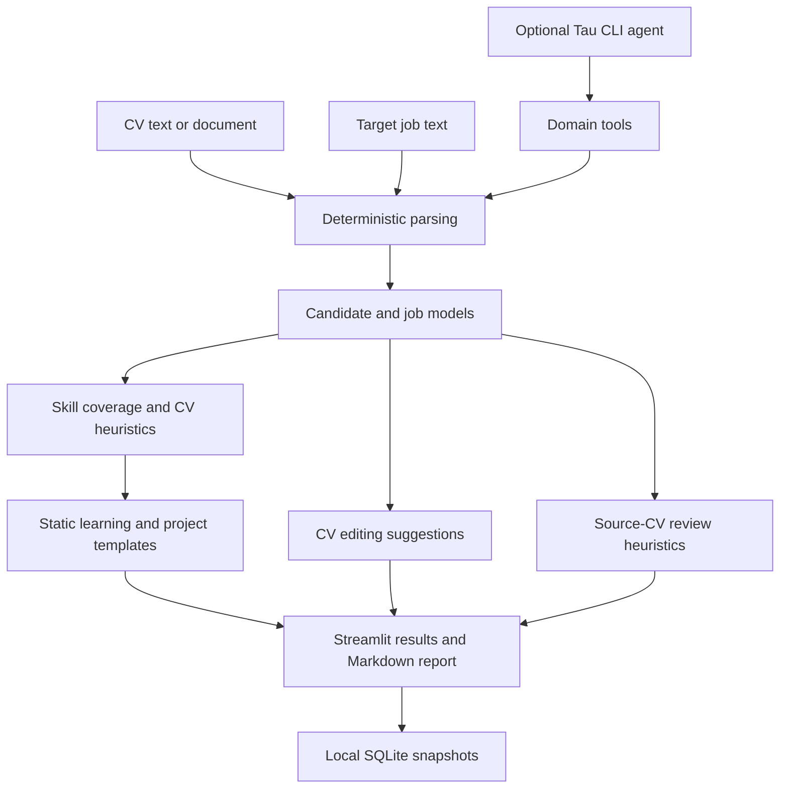
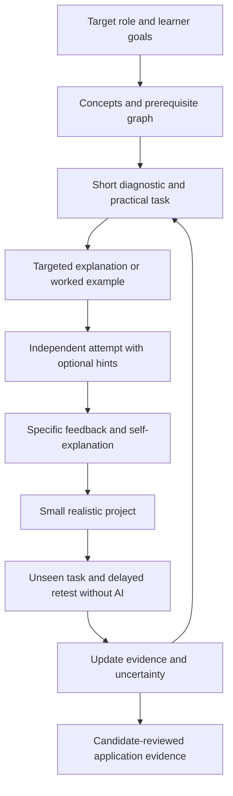

# Personal AI Agent — Job Readiness and Learning Assistant

**Goal: help applicants become stronger candidates, not just produce better-looking applications.**

The product organizes a broad career direction into related target jobs, connecting their requirements to knowledge, projects, evidence, and interview practice. It does not restrict applicants to one exact job title. Its initial audience is students and early-career applicants targeting Europe.

**Status: local prototype, not a production hiring platform or validated tutor.** The current application implements a deterministic assessment workflow, a Streamlit interface, source connectors, and optional model access. Several important capabilities remain templates or heuristics. The research-based learning system below is a proposed next stage, not a description of features already shipped.

## Contents

- [1. Run locally](#1-run-locally)
- [2. What works today](#2-what-works-today)
- [3. How to use the interface](#3-how-to-use-the-interface)
- [4. Scores, evidence, and known limitations](#4-scores-evidence-and-known-limitations)
- [5. Architecture and data flow](#5-architecture-and-data-flow)
- [6. Job sources and European coverage](#6-job-sources-and-european-coverage)
- [7. Privacy and review boundaries](#7-privacy-and-review-boundaries)
- [8. Proposed learning system](#8-proposed-learning-system)
- [9. Research papers and implementation ideas](#9-research-papers-and-implementation-ideas)
- [10. Experiments and evaluation](#10-experiments-and-evaluation)
- [11. Implementation roadmap](#11-implementation-roadmap)
- [12. Testing and troubleshooting](#12-testing-and-troubleshooting)

## 1. Run locally

Requirements: Python 3.12+, [uv](https://docs.astral.sh/uv/), and a browser. No API key is needed for local CV analysis, template plans, or typed interview practice.

```bash
git clone https://github.com/X-curiosity/Personal_AI_agent_job_application.git
cd Personal_AI_agent_job_application

# Regular install avoids an editable-install pointer issue seen on macOS.
uv sync --no-editable --reinstall-package tau-job-application

# Launch the UI from the repository directory.
uv run --no-sync tau-job-application ui

# Other entry points:
uv run --no-sync tau-job-application demo
uv run --no-sync tau-job-application analyze fixtures/candidate.txt fixtures/job.txt
uv run --no-sync pytest -q
```

After changing source code, repeat the install command: a regular installation does not automatically pick up source edits. Run from the repository so the demo can find `fixtures/` and the UI uses the intended local data directory.

### Optional credentials and network access

| Setting | Purpose | Required for basic analysis? |
|---|---|---|
| `OPENAI_API_KEY` | Optional Tau provider and explicitly requested audio transcription | No |
| `MODEL_NAME` | Model used by the optional Tau CLI command and read-only UI coach | No |
| `LINKEDIN_ACCESS_TOKEN` | Official identity endpoint for the authorized LinkedIn account | No |
| `X_BEARER_TOKEN` | Official X recent-post search, subject to account access and limits | No |
| SmartRecruiters token | Entered in the UI for the current connector | No |

```bash
export OPENAI_API_KEY="your-key"
export MODEL_NAME="a-model-supported-by-your-provider"
uv run --no-sync tau-job-application agent fixtures/candidate.txt fixtures/job.txt
```

`.env.example` documents configuration; the application does **not** automatically load a `.env` file. Export variables in the shell that launches the app. Never commit real credentials. External API access may require approval, an eligible plan, or payment.

## 2. What works today

| Area | Implemented behavior | Important boundary |
|---|---|---|
| CV intake | TXT, Markdown, selectable-text PDF, and DOCX extraction | No OCR; ordinary CV extraction uses a small English-oriented skill vocabulary |
| CV link inference | Recognizes GitHub, LinkedIn, X/Twitter, and one likely portfolio URL from CV text; shows them for verification | A detected URL is not proof of ownership or relevance; explicit UI edits override inferred values |
| Profile links | GitHub, portfolio, LinkedIn, and X fields | Portfolio/social links alone do not retrieve or validate a person's work |
| GitHub enrichment | Optional public API lookup of profile/repository language signals | No repository code review; languages are unconfirmed signals, not proof of proficiency |
| Job intake | Natural-language descriptions, one explicitly submitted public HTTPS job URL, server-rendered/JSON-LD extraction, contextual skill/capability extraction, requirement review, company-board connectors, CSV/JSON imports | No crawling; JavaScript-only/authenticated pages may fail; English-first skill heuristics need review |
| Extraction memory | Saved per-description corrections and explicitly approved phrase-to-skill mappings | Local Quick start memory, not LLM fine-tuning; repetition alone never confirms a mapping |
| Role comparison | Deterministic required/preferred skill coverage | Not a probability of being hired; no comprehensive European eligibility filtering |
| CV readiness | Heuristic structure/contact/outcome checks plus role coverage | Not a validated ATS score or assessment of intelligence/ability |
| CV tailoring | Summary, relevant skill ordering, and section-editing advice | **Not a complete rewritten résumé or PDF/DOCX export** |
| Authenticity review | Generic-phrase and claim/outcome heuristics | Cannot establish authorship or factual truth; known false-acceptance cases exist |
| Learning plan | Missing-skill list, selected prerequisites, small static resource catalog | Not yet an adaptive knowledge model or interactive dependency graph |
| Project plan | Up to three generic briefs with milestones, deliverables, and acceptance checks | No live project research or company-specific project design |
| Job monitoring | Manual refresh, local snapshots, newly observed fingerprints | No scheduled alerts, reliable closure detection, or cross-source deduplication |
| Networking | Research queries, manually entered/imported contacts | No verified referral network or automatic outreach |
| Interview practice | Role-named questions, typed responses, keyword-based feedback | Measures answer structure heuristically, not technical correctness |
| Voice input | Recording plus explicitly requested OpenAI transcription | Audio leaves the machine when transcription is requested |
| Career directions | Named workspaces containing multiple target-job threads, skill overlap, and merged learning priorities | Manual organization; not automatic role clustering or a complete semantic job search |
| Conversations | Separate persistent chat history per job thread; local report guide or optional read-only AI coach | Local mode is templated; AI mode needs credentials and explicit context-sharing consent |
| Optional agent | Bounded Tau CLI harness with domain tools; one-turn, tool-free UI coaching | Quick start scoring remains deterministic; no autonomous research subagents |
| Persistence | Shared profile, thread inputs, per-thread analysis/CV suggestions and chats, legacy snapshots, audit events, and source-watch records in SQLite | Not yet a full application-status tracker, résumé version editor, or multi-user service |

The [Jobright comparison](docs/JOBRIGHT_IMPROVEMENT_REPORT.md) contains the detailed code review and product backlog. It distinguishes Jobright's advertised features from independently verified behavior; marketing performance claims are not benchmarks for this project.

## 3. How to use the interface

### Career directions and separate job conversations

Use the **sidebar** to select a career direction and a job/conversation thread. The first launch creates Embedded Systems, Hardware, and GPU Computing as examples; you can add your own directions and rename/delete individual threads. **Move thread (keep its history)** lets you regroup jobs later—for example into a broader Hardware & Embedded direction—without losing their drafts, results, or conversations.

```text
Embedded Systems
├── Firmware Developer — company A
├── Embedded Linux Engineer — company B
└── Systems Software Engineer — company C

Hardware
├── FPGA Engineer — company D
└── Electronics Design Engineer — company E

GPU Computing
├── CUDA Engineer — company F
└── GPU Performance Engineer — company G
```

These are organizational examples, not title-matching rules. A direction can include several related titles, and a shared skill does not make two roles equivalent. Choosing a direction does not automatically search every related job title or transfer a CV claim between jobs.

**Five tabs:** Quick start, Direction overview, Conversation, Opportunities & contacts, and Interview practice.

- **Each thread owns:** editable CV/job input snapshots, the latest analysis and CV-editing suggestions, a job-specific roadmap, and a conversation history. Text inputs auto-save locally across reruns and switching; analyses and conversations survive restarting the app.
- **Shared profile:** select **Save as shared profile for new threads** to reuse a CV and links. Existing threads retain their own input snapshots; **Use latest shared profile in this thread** explicitly updates one. Old results are not silently recomputed.
- **Direction overview:** compares current analyzed jobs by extracted skills and responsibilities rather than exact titles, shows shared/unique requirements, and merges gap-driven learning priorities. Missing required coverage across multiple jobs is prioritized over a gap unique to one optional requirement. You do not need every skill from every job.
- **Across directions:** the overview can show overlapping extracted requirements, without merging conversations or implying identical roles. Learning completion/proficiency tracking is still future work.
- **Changed inputs:** old snapshots remain stored but become stale; they are excluded from comparisons and coaching until **Build my plan** is run again. Saved requirement corrections also invalidate snapshots using that exact job text.
- **Deletion:** deleting a thread removes its inputs, latest result, and chat. It does not delete the separate shared profile, approved extraction memory, or legacy analysis records.

The tables are `career_workspaces`, `career_threads`, `career_messages`, and `career_shared_profile` in `.job_assistant/assistant.sqlite`. Pre-workspace entries in the legacy `analyses` table are preserved but not automatically assigned to a direction.

### Quick start

1. Select a direction and a target-job thread in the sidebar.
2. Drag in a CV or paste text. New uploads populate the editable CV text field; analysis uses the text shown there.
3. The UI detects recognizable GitHub, LinkedIn, X/Twitter, and portfolio URLs in the CV. Verify or edit these fields; only the links you confirm are used in the profile.
4. Paste a target job URL and select **Read job URL**. The app fetches only that explicit public HTTPS URL, follows only public HTTPS redirects, reads server-rendered text and Schema.org `JobPosting` JSON-LD, and populates title, company, description, and source URL. You can edit the extracted fields before analysis. If the page is blocked, JavaScript-only, authenticated, too large, unsafe, or lacks inferable requirements, paste the description manually.
5. Alternatively paste a job description directly. Title/company can be entered separately.
6. Requirement review is optional and collapsed by default. Open it to inspect inferred capability phrases, source quotes, required/preferred/uncertain labels, and heuristic confidence; leave feedback or save corrections only if you want to help improve extraction.
7. Select **Build my plan**.
6. Review the three result columns:
   - **Tailored CV:** draft summary, skill ordering, and editing suggestions.
   - **Improvements:** score components, next actions, and heuristic review findings.
   - **Roadmap:** skill gaps, resources, and project briefs displayed in expanders.
7. Download the Markdown planning report. The current UI blocks this download when the heuristic authenticity status is `blocked`; this is a prototype behavior, not a reliable factual-verification gate.

A simple synthetic input for testing:

```text
Name: Alex Example
Headline: Junior backend developer
Skills: Python, SQL
Experience: Built a Python service with automated tests.
```

```text
Title: Backend Engineer
Company: Example Systems
Required skills: Python, Docker
Preferred skills: SQL
```

Inspect candidate skills yourself: there is not yet a candidate-profile confirmation editor. Job requirements now have the review editor below. Updating input fields does not automatically recompute an existing result: select **Build my plan** again.

### Natural-language requirement extraction and learning

You do **not** need `Skills:` or `Required skills:` fields in a job description. For example:

```text
You are experienced with Python and SQL.
You are comfortable building APIs.
Projects involving Docker are a plus.
You have worked with ClickHouse.
No experience with Kubernetes required.
```

The extractor proposes Python, SQL, API development, Docker (preferred), and ClickHouse (a new phrase needing review). It excludes the negated Kubernetes requirement. It also considers headings such as `Requirements`, `Responsibilities`, and `Nice to have`, and phrases such as `familiar with`, `knowledge of`, `background in`, and `proficient in`.

- **Source grounding:** each suggestion includes the exact source clause, character location, extraction method, and a heuristic confidence value. These values are not calibrated probabilities.
- **Feedback:** the optional rating/comment is stored locally against the job-description hash. It is product feedback, not silent model training; only explicitly reviewed phrase mappings can affect future extraction.
- **Capabilities rather than invented tools:** “building APIs” can suggest API development; “relational databases” does not prove the employer specifically requires PostgreSQL.
- **Importance:** required/preferred status comes from the local clause and section. Standalone stack mentions can remain `uncertain`; uncertain requirements are excluded from scored coverage and missing-skill project plans.
- **Unknown vocabulary:** short phrases after experience/project cues are proposed even when the term is outside the built-in skill list. They remain reviewable; this is not a guarantee that every phrase is a useful skill.
- **Compatibility:** explicit required/preferred lists still work and are combined with prose rather than replacing it.

Under the target job, open **Review inferred requirements / leave parsing feedback (optional)**:

1. Edit skill names and required/preferred/uncertain labels, remove false positives, or add a missed requirement with a quote copied exactly from the job.
2. Confirm your review and select **Save corrections for this description**. Select **Build my plan** to recalculate the assessment. Exact copies of this description reuse the saved correction; changed descriptions are parsed afresh.
3. To generalize a correction, enter a short source phrase and its reviewed skill label, opt into reuse, and select **Remember mapping**. For example, review “event-driven services” as “Event-driven architecture” and remember that mapping.
4. On a future job, that phrase maps to the reviewed skill. Importance is determined again from the new job: the old required/preferred label is not blindly copied.
5. **Forget mapping** and **Forget corrections for this description** remove those respective memory entries. They are separate controls; removing an alias does not erase an independently saved job review.

Memory is stored in the local SQLite tables `skill_alias_memory`, `requirement_reviews`, and `requirement_feedback` under `.job_assistant/`. It contains reviewed job quotations and labels, not CV-derived training records or credentials. It is supplied to Quick start analyses; standalone Python callers can opt in through `parse_job_text(..., memory=...)` or `analyze_texts(..., requirement_memory=...)`. CLI tools and source-board fetchers use stateless extraction unless a caller explicitly provides memory.

**What “learning” means here:** accumulating user-approved, reversible extraction corrections—not silently training on every upload or updating an external model. Precision can improve for reviewed phrases, but incorrect corrections can also reduce it; keep testing on unseen descriptions. Complex negation, alternatives (“Python or Java”), unfamiliar wording, and non-English descriptions still require human review. The built-in capability rules do not replace a general semantic model.

### Visual design

The Quick start is intentionally modeled around a compact job-search flow: profile input → target job → one primary action → result cards for tailored CV, improvements, and roadmap. The sidebar keeps career directions and target-job threads visible, while advanced sourcing and interview practice remain separate tabs. Cards and expanders provide progressive disclosure so skill review does not interrupt first-pass analysis. The layout is optimized for desktop; Streamlit provides basic responsive behavior, but a narrow-mobile visual review remains future work.

### Opportunities & contacts

- Enter a real employer's board identifier for Greenhouse, Lever, or Recruitee.
- Fetch and monitor jobs manually. “New” means newly observed by this local database, not necessarily newly published.
- Use official-platform connectors only with appropriate access.
- Import contacts/jobs obtained with permission as CSV or JSON; up to 500 records and 5 MB are processed. Rows that cannot be parsed can currently be skipped without detailed feedback.
- Source-board and imported jobs have **Open in a new job thread** buttons. These populate title, company, URL, and description in the current career direction, with the shared CV as a starting point. Review the new thread and build its plan.

Example CSV schemas:

```csv
name,role,profile_url,public_email,evidence
Alex Example,Engineering Lead,https://example.com/team/alex,,User-provided company team page
```

```csv
title,company,required_skills,preferred_skills,url
Backend Engineer,Example Systems,"Python, Docker",SQL,https://example.com/careers/backend
```

JSON accepts a list of objects with equivalent fields, or an object containing a `data` or `items` list. Preserve provenance; an imported email is not independently verified just because it is present.

### Conversation

Each target-job thread has an independent **Conversation** tab. History is saved locally and can be downloaded as text. Switching threads restores the chosen history, not a global chat.

- **Local report guide (default):** no API key or model call. Ask for `skill gaps`, `CV suggestions`, `project roadmap`, or `compare roles`. It navigates saved results through templates; it is not an open-ended tutor.
- **Optional AI coach:** enable the model toggle and explicitly consent to sending context. `OPENAI_API_KEY` and `MODEL_NAME` must be available. Preview the exact context before submitting: the current non-stale analysis (including candidate/job data), up to 12 messages from this thread, and job/skill summaries from this direction. Other directions and other threads' conversations are not sent.
- **Boundaries:** coaching is read-only, with no tools, a one-turn limit, a 60-second timeout, and bounded input size. It cannot change official scores, submit applications, or create evidence. Model responses may still be wrong; review advice before acting. Failed requests do not save partial turns.

### Interview practice

Complete a current assessment in the active thread first, select a question, and type an answer. Interview inputs/transcripts are keyed by thread and question to avoid mixing them; unlike the Conversation tab, interview answers are not yet a persistent practice history. Recording is optional. Selecting transcription sends the recording to OpenAI. Feedback currently checks expressions associated with context, action, validation, and reflection. It does not assess whether an engineering explanation is correct.

## 4. Scores, evidence, and known limitations

### Current scoring rules

`matching.py` calculates:

```text
role coverage = round(100 × (0.8 × required coverage + 0.2 × preferred coverage))
```

A requirement matches when a skill mapping resolves to evidence marked `confirmed`. That flag currently reflects parser rules, not an independent fact check.

`career.py` combines four heuristic components:

| Component | Weight |
|---|---:|
| Target-role coverage | 55% |
| CV structure | 20% |
| Contact/portfolio presence | 10% |
| Outcome wording/numbers | 15% |

These weights are design choices, not scientifically calibrated hiring predictors. A 90/100 score is neither a promise of interviews nor proof that the candidate understands a subject.

### Known issues to fix first

1. **Absent requirements receive automatic credit.** An empty preferred list contributes full preferred credit: a candidate with no matching skills can receive 20/100. Normalize weights over groups actually present.
2. **Confirmation is inconsistent.** An explicit `Skills:` list is marked confirmed automatically; keywords extracted from prose are not. Introduce explicit user confirmation and distinguish self-report from demonstrated competence.
3. **Skill aliases can overstate evidence.** `unit testing` currently maps to `pytest`, although the former does not imply experience with that specific tool.
4. **Authenticity is not verified.** Numbers or overlapping skill words can exempt unsupported statements. A diagnostic claim, “Managed 200 hospitals worldwide,” returned `ready` without supporting evidence. Generic wording cannot reveal whether AI wrote a CV.
5. **Source provenance is incomplete.** Some evidence quotes are summaries or clipped document text, not exact claim spans. Evidence IDs alone do not establish entailment.
6. **Final-draft review is missing.** The authenticity module checks the source CV, not a complete final résumé against approved claims. Disclosure suggestions should depend on actual AI assistance, not a style heuristic.
7. **Monitoring confuses identity with content.** Its fingerprint includes requirements, so an edited role can appear new. A failed/partial fetch must not be interpreted as closure.
8. **Adapters and imports can silently omit data.** Add schema fixtures, pagination/detail retrieval where needed, source completeness indicators, and explicit error reporting.

Treat `ready`, `needs_review`, and `blocked` as current heuristic labels, not certifications. Do not inflate metrics to satisfy the checks. Qualitative outcomes, reproducible tests, and a truthful account of personal contribution can all be useful evidence.

## 5. Architecture and data flow



```text
src/tau_job_application/
├── agent.py             # optional Tau harness, instructions, turn limit
├── tools.py             # typed tool adapters for domain functions
├── models.py            # Pydantic candidate/job/evidence/report contracts
├── parsing.py           # local file extraction and candidate/job parsing
├── job_pages.py         # safe one-URL HTML/JSON-LD job-page extraction
├── requirements.py      # contextual job requirements and sourced review validation
├── requirement_memory.py # local approved phrase mappings and job corrections
├── matching.py          # deterministic skill coverage
├── career.py            # CV heuristics, template tailoring, contact queries
├── authenticity.py      # source-CV wording/claim heuristics
├── planning.py          # static skill resources and project templates
├── sources.py           # company-board APIs and GitHub signals
├── official_sources.py  # official-platform reads and CSV/JSON imports
├── monitoring.py        # local source/job snapshots
├── interview.py         # questions, structure checks, audio transcription
├── pipeline.py          # analysis orchestration and Markdown rendering
├── storage.py           # legacy analysis/audit SQLite storage
├── workspaces.py        # directions, thread/profile/chat storage, skill aggregation
├── workspace_ui.py      # sidebar, direction overview, conversations
├── workspace_chat.py    # scoped local guide and optional read-only model coach
├── cli.py               # demo, analyze, agent, ui commands
└── ui.py                # Streamlit interface
```

Dependencies are pinned/bounded in `pyproject.toml` and resolved in `uv.lock`. The `tau-ai` distribution supplies both `tau_ai` and `tau_agent`; the application does not modify Tau internals.

## 6. Job sources and European coverage

Source adapters are present, but this is **not** a comprehensive European job index. Coverage depends on which employers/boards the user supplies. Multilingual parsing, work authorization, salary normalization, and country-specific remote eligibility remain future work.

| Connector | Current scope | Reference |
|---|---|---|
| Greenhouse | Company public job board | [Job Board API](https://developers.greenhouse.io/job-board.html) |
| Lever | Company public postings | [Postings API](https://github.com/lever/postings-api) |
| Recruitee | Company careers-site offers | [Careers Site API](https://docs.recruitee.com/reference/intro-to-careers-site-api) |
| SmartRecruiters | Current adapter accepts a company token and reads listings; detail mapping needs validation | [Posting API](https://developers.smartrecruiters.com/docs/posting-api) |
| LinkedIn | Authorized user's OIDC identity only, not résumé extraction or people search | [OIDC integration](https://learn.microsoft.com/en-us/linkedin/consumer/integrations/self-serve/sign-in-with-linkedin-v2) |
| X | Explicit recent-post search; posts are signals, not verified vacancies | [X API documentation](https://docs.x.com/) |
| User job URL | One explicit public HTTPS fetch; no crawler/search, response cap, public DNS/redirect checks, readable text + JSON-LD | [Schema.org JobPosting](https://schema.org/JobPosting) |
| CSV/JSON | User-provided job/contact records | Import formats above |

EURES, Welcome to the Jungle, XING, StepStone, and national employment-service integrations are **not implemented**. Their current access/usage terms need individual review; this is not a claim that all require the same commercial arrangement.

See [European source strategy](docs/EU_JOB_SOURCE_STRATEGY.md) for research context. Validate its assumptions against current official documentation before adding a connector. A funding round or product release can motivate research but does not prove hiring.

## 7. Privacy and review boundaries

- The product has no application-submission or messaging tools. Its current social-platform integrations are explicit official API reads, not browser scraping.
- A submitted job URL is fetched only on the user's explicit button press. The fetcher rejects non-HTTPS URLs, embedded credentials, local/private/reserved addresses, unsupported content types, oversized responses, and non-public redirects. It does not crawl linked pages.
- Analysis snapshots contain CV text and personal data in `.job_assistant/assistant.sqlite`. Git ignores this directory, but **Git exclusion is not encryption**.
- The UI is a local prototype without multi-user authentication/isolation. Do not expose it publicly without additional security work.
- API tokens are not deliberately written to SQLite. However, password widgets can retain values in server-side session memory; “used once and immediately erased” is not a guarantee.
- The optional Tau CLI sends supplied CV/job text to the configured provider. The optional UI coach sends the explicitly previewed thread/direction context after consent. Transcription sends audio to OpenAI. Public-source requests send the identifiers/queries required by those services.
- Portfolio/social URLs, imported contact details, and generated text must be reviewed. A URL's presence or an email's format does not verify a person's role or address.
- Data-retention, selective deletion, consent records, credential clearing, and error-redaction tests remain necessary improvements.
- No AI-authorship percentage, ATS-pass guarantee, hiring probability, or independently verified CV claim is produced by the current system.

## 8. Proposed learning system

**Everything in this section is a proposed design.** The current resource list and interview prompts are only starting points.

### Separate three things

| Record | What it means | What it does not mean |
|---|---|---|
| Job requirement | An employer requests a capability | The requirement is necessarily essential or correctly extracted |
| Learner state | Evidence from attempts, explanations, hints, and later tests | A CV keyword proves mastery |
| Application evidence | A reviewable project, contribution, or achievement | Completing a course automatically creates work experience |

The product should track these separately. Better writing can improve clarity without improving knowledge; studying can improve knowledge before it creates publishable project evidence.

### Learning loop



For each concept, record its definition, prerequisites, example, common misconceptions, assessment rubric, source resources, and review history. Attempts should store whether assistance was used; assisted success and independent success must not be treated as equivalent.

### Example: preparing for a backend role requiring Docker

1. **Diagnose:** ask the learner to distinguish images, containers, processes, ports, and persistent storage; include a small debugging task.
2. **Explain:** use one worked example, with an explanation of why each configuration choice is necessary.
3. **Practice:** let the learner containerize a small API. Offer hints before a complete solution, without trapping them in endless questioning.
4. **Explain back:** ask why an application binding to localhost inside a container may not be reachable through a published port.
5. **Transfer:** give a different application's broken container/network configuration to diagnose without AI help.
6. **Retain:** revisit the concept later with a different task, not the same memorized answer.
7. **Publish evidence:** retain the repository, tests, reproducible run instructions, limitations, and the candidate's actual contribution.
8. **Update the application:** only after review, describe the completed project accurately. Do not turn it into invented employment experience.

The same structure can serve other fields: an analyst can critique a model on a new dataset; a designer can defend a decision under changed constraints. Field-specific tasks and rubrics need domain-expert review.

### Resource selection

For each gap, recommend a small sequence: prerequisite explanation → official reference or textbook chapter → practice task → applied project → deeper paper. Record the author's/source authority, assumed prerequisites, language, access cost, estimated effort, and why the material is relevant. Avoid assigning an advanced research paper before the learner has its foundations. A link list is not a curriculum.

## 9. Research papers and implementation ideas

The references below separate **published findings** from **our proposed application**. They do not establish that this product improves hiring outcomes. Findings from prose recall, programming tutors, or school mathematics must be tested before being generalized to European job applicants.

Suggested first reads: **Dunlosky → Roediger & Karpicke → Chi → Bastani → RAG → τ-bench**. Add the others when implementing the corresponding feature.

### A. Helping applicants actually learn

#### 1. Dunlosky et al. (2013) — learning techniques

**John Dunlosky, Katherine A. Rawson, Elizabeth J. Marsh, Mitchell J. Nathan, and Daniel T. Willingham.** *Improving Students' Learning With Effective Learning Techniques: Promising Directions From Cognitive and Educational Psychology.* Psychological Science in the Public Interest.

[Paper / DOI](https://doi.org/10.1177/1529100612453266) · [Accessible overview](https://www.psychologicalscience.org/publications/journals/pspi/learning-techniques.html)

- **Read for:** evidence comparing techniques, especially practice testing and distributed practice, rather than relying on rereading/highlighting alone.
- **Proposed change:** add retrieval tasks and spaced reviews to `planning.py`; record responses instead of checking off “read this resource.”
- **Experiment:** equal study time with a resource list versus a resource list plus spaced retrieval; measure delayed independent performance.
- **Boundary:** a review of learning techniques does not specify the best schedule or curriculum for every learner and field.

#### 2. Roediger & Karpicke (2006) — retrieval practice

**Henry L. Roediger III and Jeffrey D. Karpicke.** *Test-Enhanced Learning: Taking Memory Tests Improves Long-Term Retention.* Psychological Science.

[Paper / DOI](https://doi.org/10.1111/j.1467-9280.2006.01693.x)

- **Read for:** the difference between immediate familiarity and later recall; retrieval can contribute to learning, not merely measure it.
- **Proposed change:** ask for an explanation or solution before revealing the reference answer; revisit concepts using new prompts.
- **Experiment:** compare rereading with retrieval practice on a delayed, no-AI assessment.
- **Boundary:** the experiments used prose-learning tasks; do not assume recall gains alone demonstrate engineering competence or transfer.

#### 3. Chi et al. (1989) — self-explanation

**Michelene T. H. Chi, Miriam Bassok, Matthew W. Lewis, Peter Reimann, and Robert Glaser.** *Self-Explanations: How Students Study and Use Examples in Learning to Solve Problems.* Cognitive Science.

[Paper / DOI](https://doi.org/10.1207/s15516709cog1302_1) · [Author-hosted PDF](https://education.asu.edu/sites/g/files/litvpz656/files/lcl/chibassoklewisreimannglaser_0.pdf)

- **Read for:** how learners connect example steps to principles and identify gaps in their own understanding.
- **Proposed change:** add “why does this step work?”, “what assumption is necessary?”, and “what changes if this condition changes?” prompts after worked examples and projects.
- **Experiment:** grade novel transfer tasks after example-only versus example-plus-explanation practice.
- **Boundary:** fluent explanations can be wrong. Grade their reasoning against a domain rubric, not word count or confidence.

#### 4. Collins, Brown & Newman (1987 technical report) — cognitive apprenticeship

**Allan Collins, John Seely Brown, and Susan E. Newman.** *Cognitive Apprenticeship: Teaching the Craft of Reading, Writing, and Mathematics.* Technical Report No. 403.

[ERIC record and full-text access](https://eric.ed.gov/?id=ED284181)

- **Read for:** modeling, coaching, scaffolding, articulation, reflection, and exploration. This is a design framework, not a randomized evaluation of our workflow.
- **Proposed change:** sequence projects from a worked example to a partly supported task and then an independent task. Gradually remove assistance; ask learners to explain decisions and compare alternatives.
- **Experiment:** compare scaffolding that fades with constant answer assistance, using a new independent project as the outcome.
- **Boundary:** software that completes every project for the learner may improve artifacts without improving the learner's ability.

#### 5. Corbett & Anderson (1994) — knowledge tracing

**Albert T. Corbett and John R. Anderson.** *Knowledge Tracing: Modeling the Acquisition of Procedural Knowledge.* User Modeling and User-Adapted Interaction.

[Paper / DOI](https://doi.org/10.1007/BF01099821)

- **Read for:** estimating a learner's changing skill state from sequences of responses, including uncertainty about guesses and slips.
- **Proposed change:** add a separate learner-state store; begin with transparent rules, then compare a Bayesian knowledge-tracing model when enough concept-labeled response data exists.
- **Experiment:** predict later independent answers and evaluate calibration on held-out learners. Compare with a simple recent-performance baseline.
- **Boundary:** inferred mastery depends on task labels and model assumptions. It is neither a CV score nor proof of broad professional competence.

#### 6. Bastani et al. (2025) — AI assistance versus learning

**Hamsa Bastani, Osbert Bastani, Alp Sungu, Haosen Ge, Özge Kabakcı, and Rei Mariman.** *Generative AI without guardrails can harm learning: Evidence from high school mathematics.* PNAS.

[Paper / DOI](https://doi.org/10.1073/pnas.2422633122) · [Data and code](https://github.com/obastani/GenAICanHarmLearning)

- **Read for:** the distinction between doing well while using AI and learning to perform after the assistance is removed; tutor design matters.
- **Proposed change:** separate practice mode from independent assessment. Use graduated hints, record assistance, and include no-AI follow-up tasks.
- **Experiment:** compare answer-first and hint-first tutoring, measuring later unaided performance rather than only supported task completion.
- **Boundary:** the field experiment concerns high-school mathematics, not CV preparation or professional hiring. It motivates local evaluation, not a universal claim that AI harms learning.

#### 7. Wang et al. (2024; revised 2025) — Tutor CoPilot

**Rose E. Wang et al.** *Tutor CoPilot: A Human-AI Approach for Scaling Real-Time Expertise.* Research preprint.

[Paper, arXiv:2410.03017](https://arxiv.org/abs/2410.03017) · [Demonstration code](https://github.com/rosewang2008/tutor-copilot/)

- **Read for:** supporting human tutors with pedagogical suggestions instead of replacing them with unrestricted answer generation.
- **Proposed change:** prototype a mentor view where a human can review suggested questions, hints, and feedback before the learner receives them.
- **Experiment:** compare mentor-only and mentor-plus-assistant sessions, tracking independently assessed learning and mentor workload.
- **Boundary:** this is evidence about a human–AI tutoring system in a specific educational setting, not evidence for fully autonomous career coaching. Results vary by paper version; do not mix reported samples.

### B. Improving the agent's technical reliability

#### 8. Lewis et al. (2020) — retrieval-augmented generation

**Patrick Lewis et al.** *Retrieval-Augmented Generation for Knowledge-Intensive NLP Tasks.* NeurIPS.

[Paper, arXiv:2005.11401](https://arxiv.org/abs/2005.11401)

- **Read for:** conditioning generation on retrieved material instead of relying only on model parameters.
- **Proposed change:** give explanations and résumé drafts a bounded evidence pack containing approved CV spans, role requirements, and vetted educational sources. Require source references for material claims.
- **Experiment:** compare generation without retrieval against retrieval-assisted drafting on unsupported-claim rate, citation correctness, and human usefulness.
- **Boundary:** retrieval and citations do not guarantee entailment or truth. Start with exact evidence lookup; a vector database is not automatically necessary. Our adapter would borrow the pattern, not reproduce the paper's trained architecture.

#### 9. Reimers & Gurevych (2019) — semantic matching

**Nils Reimers and Iryna Gurevych.** *Sentence-BERT: Sentence Embeddings using Siamese BERT-Networks.* EMNLP-IJCNLP.

[Paper, arXiv:1908.10084](https://arxiv.org/abs/1908.10084)

- **Read for:** efficient sentence representations for similarity and retrieval.
- **Proposed change:** compare explicit skill aliases with embedding-based candidate mappings for differently worded job requirements; keep original text and require review for uncertain mappings.
- **Experiment:** evaluate precision/recall on human-labeled equivalents and deliberately related-but-not-equivalent pairs; test relevant languages separately.
- **Boundary:** similarity is not proof of competency or semantic equivalence. “Studied cloud computing” must not automatically become “operated AWS infrastructure.” European languages require appropriate models and evaluation data.

#### 10. Yao et al. (2022 preprint; ICLR 2023) — ReAct

**Shunyu Yao et al.** *ReAct: Synergizing Reasoning and Acting in Language Models.*

[Paper, arXiv:2210.03629](https://arxiv.org/abs/2210.03629)

- **Read for:** interleaving model decisions with tool observations rather than generating an entire plan without checking external state.
- **Proposed change:** extend the existing Tau harness with narrow tools for approved evidence retrieval, diagnostic tasks, and learning-plan updates. Keep scores, permissions, and canonical state changes in application code.
- **Experiment:** compare a fixed workflow with a bounded tool-using agent on missing information, source failures, and invalid tool inputs. Measure correctness, cost, and latency.
- **Boundary:** additional agent turns do not guarantee better output. Expose concise action/results logs, not private internal reasoning; keep tool and cost limits.

#### 11. Yao et al. (2024) — τ-bench

**Shunyu Yao et al.** *τ-bench: A Benchmark for Tool-Agent-User Interaction in Real-World Domains.*

[Paper, arXiv:2406.12045](https://arxiv.org/abs/2406.12045)

- **Read for:** evaluating stateful agent tasks, policy compliance, and consistency over repeated runs rather than judging only plausible prose.
- **Proposed change:** build scenario tests such as “candidate rejects a CV claim,” “job source is unavailable,” and “a learner's project is incomplete.” Check final records and allowed actions.
- **Experiment:** repeat tasks with fake and live providers, measuring correct final state, unauthorized actions, and consistency across runs.
- **Boundary:** original benchmark domains are not this application. Borrow the evaluation method and create our own domain fixtures. The benchmark and the installed Tau library are distinct projects.

### Reading notes template

For each paper, write a short engineering note:

1. What problem did the authors study, with which participants/data/tasks?
2. What did they actually measure, and what remains uncertain?
3. Which single product change does this suggest?
4. What simple baseline should it beat?
5. What would count as failure or negative evidence?
6. What domain/language differences make direct transfer uncertain?

Read methods and limitations, not just abstracts. These links identify the source papers; the proposed implementations are our design hypotheses, not author endorsements.

## 10. Experiments and evaluation

### Compare approaches before adding complexity

| Approach | Suitable starting point | Compare against | Main outcome |
|---|---|---|---|
| Static prerequisite map + retrieval practice | Low-data MVP | Existing resource list | Delayed recall and task performance |
| Worked examples + self-explanation + fading hints | Project preparation | Complete-solution assistance | Independent transfer task |
| Retrieval-grounded adaptive tutor | Vetted source library available | Same tutor without retrieval | Correct feedback and supported explanations |
| Bayesian knowledge tracing | Enough reliable concept-labeled attempts | Simple recent-performance rules | Calibration on later independent attempts |
| Human mentor + AI suggestions | High-stakes or ambiguous topics | Mentor alone | Learning improvement and mentor effort |
| Multi-agent research | Only after a single workflow shows a measurable bottleneck | One bounded agent | Evidence quality, latency, cost, and failure rate |

Do not assume multiple agents are better. The product currently has none; splitting a workflow adds coordination and error-propagation risks.

### Small pilot protocol

1. Choose one field and a narrow concept set, such as backend fundamentals. Have a domain expert review tasks and rubrics.
2. Give participants a baseline task and collect prior experience; keep learning data separate from application claims.
3. Randomly assign comparable practice conditions where feasible, with equal time/resources and informed consent. Offer delayed access to useful materials to comparison participants.
4. Use unseen assessment tasks without AI assistance immediately after practice and again after a delay. A one-week retest is a practical starting choice, not a universal optimum.
5. Score with a fixed rubric, preferably blinded to condition. Combine automated checks with human review of explanations and trade-offs.
6. Report sample size, attrition, assistance usage, uncertainty, and negative results. A small pilot tests feasibility; it does not prove broad effectiveness. Choose a larger study's sample size using a power analysis.

### What to measure

- **Knowledge:** delayed retrieval and correctness of explanations.
- **Understanding:** ability to justify decisions, identify assumptions, and diagnose misconceptions.
- **Transfer:** performance on a new problem, not a memorized example.
- **Independence:** attempts solved without assistance and hints needed during practice.
- **Project evidence:** reproducibility, tests, limitations, and attributable personal contribution.
- **Agent reliability:** supported draft claims, citation accuracy, correct final state, adapter completeness, cost, and latency.
- **Application usefulness:** user-rated shortlist relevance, correction burden, and time to a reviewed application.

Course completions, time spent chatting, polished explanations, and higher CV scores are not sufficient learning outcomes. Hiring/interview outcomes can be tracked with consent, but market conditions and selection effects prevent simple causal attribution to the app.

## 11. Implementation roadmap

Detailed product comparison: [Jobright improvement report](docs/JOBRIGHT_IMPROVEMENT_REPORT.md).

| Order | Deliverable | Acceptance condition |
|---|---|---|
| 1 — Correctness | Explicit claim review, confirmation editor, score fixes, adapter fixtures | Numbers/keywords cannot verify a new claim; zero matches yield zero coverage; partial fetches are visible |
| 2 — Application workflow | Europe-aware shortlist, complete résumé editor, reviewed export, application tracker | Select a role, edit and approve a full résumé, download it, and restore application history after restart |
| 3 — Learning MVP | Diagnostic tasks, concept graph, retrieval review, project evidence | Learner completes an unseen task and delayed retest; only reviewed evidence changes the application profile |
| 4 — Adaptive support | Source-grounded tutor, validated feedback, optional mentor view | Beats a simple baseline on independently assessed learning without unacceptable cost/error increases |
| 5 — Discovery | Stable job identities, updates/closures, sourced networking, opt-in alerts | Updates are not duplicates; outages do not close jobs; scheduling follows provider rules and user preferences |

Keep the UI simple: **shared profile → career direction → target-job thread → reviewed application → learn/build next → demonstrate progress**. Avoid spending effort on bulk autofill before the core workflow and learning outcomes are reliable.

## 12. Testing and troubleshooting

### Existing regression suite

```bash
uv run --no-sync pytest -q
uv run --no-sync python -m py_compile src/tau_job_application/*.py
```

The suite now includes contextual requirement extraction, review-memory persistence/reuse/deletion, invalid source-quote rejection, scoped workspace/chat persistence, shared-profile behavior, stale snapshot handling, skill aggregation, a fake-provider read-only coaching test, and Streamlit review/navigation/restart tests, alongside the original regression tests. These primarily cover synthetic examples and mocked responses. Some tests encode permissive heuristic behavior; they need to change when the known issues are fixed. A green test suite does not prove that live APIs, multilingual documents, authorship checks, or a full browser workflow work correctly.

### Manual checks

- Run `demo` and compare the report with `fixtures/candidate.txt` and `fixtures/job.txt`.
- Upload selectable-text PDF, DOCX, TXT, and Markdown examples; inspect extracted facts rather than trusting a score.
- Try empty documents, scanned PDFs, unsupported formats, and job text without recognized skills; expect explicit errors.
- Use an employer's **verified current** board identifier rather than assuming a company uses a particular ATS.
- Refresh an unchanged board twice: expect no new fingerprints on the second run, subject to the monitoring limitations above.
- Exercise imports with missing columns, invalid JSON, duplicates, and oversized files.
- Check that numerical claims and generic phrases do not get mistaken for independent truth/authorship verification.
- Confirm no transcription/API request happens until its action is selected; inspect only synthetic audit data for credential leakage.
- Test browser reruns, stale results after input edits, failed GitHub enrichment, download behavior, and question-specific transcript handling.

### Next automated tests

Add multilingual parsing fixtures, unsupported-generated-claim regressions, exact evidence-span checks, provider contract/pagination tests, scoring edge cases, stable job-identity tests, credential-redaction tests, and Streamlit interaction tests. Use synthetic documents or explicitly consented data; do not commit private CVs or application files.

### Common problems

| Symptom | What to check |
|---|---|
| Package cannot be imported after editable install | Use the regular `uv sync --no-editable --reinstall-package ...` command above |
| Source edits do not appear in the UI | Reinstall the package and restart Streamlit |
| Scanned PDF yields no text | OCR it externally first; OCR is not implemented |
| Real CV scores poorly despite relevant skills | Inspect parsing and confirmation status; the vocabulary and matching rules are limited |
| Job board returns no jobs | Check identifier, provider access, response shape, and skipped parsing; an empty list is not proof that hiring stopped |
| Token in `.env` has no effect | Export it in the launch shell; `.env` is not automatically loaded |
| API request fails | Check permissions, rate limits, network access, and provider-plan requirements |

---

## References and project notes

- [Jobright comparison and code-review backlog](docs/JOBRIGHT_IMPROVEMENT_REPORT.md)
- [European job-source strategy](docs/EU_JOB_SOURCE_STRATEGY.md)
- [Jobright public homepage](https://jobright.ai/) — product inspiration, not independently validated performance evidence
- [Tau library](https://github.com/huggingface/tau) — optional agent dependency
- [ESCO](https://esco.ec.europa.eu/en) — potential skill/occupation vocabulary; not integrated yet

This is a learning and application-preparation prototype. Source permissions, privacy requirements, and employer-specific application rules must be checked for the intended deployment. No claim is made that the system guarantees job offers, verifies authorship, or replaces domain expertise.
